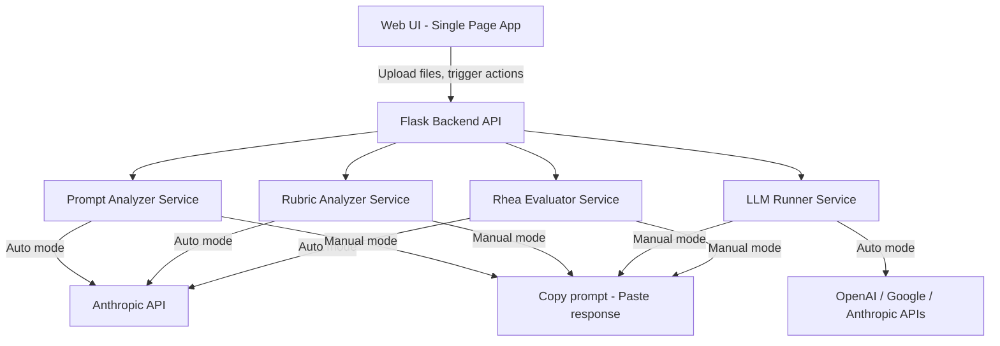

# Shake Analyzer - Local Web Application

## Tech Stack

- **Backend**: Python 3.11+ with Flask
- **Frontend**: Single-page HTML + Tailwind CSS (via CDN) + vanilla JavaScript
- **LLM SDKs**: `openai`, `google-generativeai`, `anthropic`
- **Config**: `.env` file for API keys (loaded via `python-dotenv`)
- **File handling**: `werkzeug` (bundled with Flask) for uploads; files stored in `uploads/` directory

## Dual Mode: Automatic (API keys) and Manual (copy/paste)

The app supports two modes for every LLM-dependent feature:

- **Automatic mode**: If API keys are configured in `.env`, the app calls the models directly. Fully automated.
- **Manual mode (default)**: If no API keys are present, the app formats the complete prompt (with all context) ready to copy. The user pastes it into the model of choice (ChatGPT web, Claude web, Gemini web, or Cursor), gets the response, and pastes it back into the app. The app handles all analysis, comparison, and evaluation from there.

This applies to all 4 features: Prompt Analysis, Rubric Analysis, LLM Testing, and Rhea Evaluator.

## Architecture



## Directory Structure

```
shake_analyzer/
  app.py                    # Flask app with all API routes
  requirements.txt          # Dependencies with versions
  .env.example              # Template for API keys
  README.md                 # Setup and usage instructions
  static/
    css/
      style.css             # Custom styles on top of Tailwind
    js/
      app.js                # Frontend logic (uploads, API calls, rendering)
  templates/
    index.html              # Single-page UI with all sections
  services/
    __init__.py
    prompt_analyzer.py      # Prompt quality analysis using Opus 4.6
    rubric_analyzer.py      # Rubric quality analysis using Opus 4.6
    llm_runner.py           # Send prompt + files to selected LLM(s)
    rhea_evaluator.py       # Rhea system: evaluate model response vs rubrics
  uploads/                  # Temporary storage for uploaded files
```

## UI Layout (Single Page with Tab Navigation)

The page will have a persistent **upload panel** at the top and **four tab sections** below:

### Upload Panel (always visible)
- **Prompt input**: text area for pasting OR file upload (supports `.txt`, `.md`, `.pdf`, `.docx`)
- **Context files**: drag-and-drop multi-file upload area (any format)
- **Rubrics input**: text area for pasting OR file upload
- Status indicators showing what has been loaded

### Tab 1: Prompt Analysis
- **Auto mode** (if Anthropic key configured): Button "Analyze Prompt" sends to Opus 4.6 directly
- **Manual mode** (no key): Button "Generate Analysis Prompt" produces a formatted prompt with the Expert Instructions criteria baked in. User copies it, runs in any model, and pastes the analysis back. The app then parses and displays the results.
- Evaluates against Expert Instructions criteria:
  - Does the prompt present a detailed crisis scenario?
  - Does it include seeded organizational context (rosters, locations, policies, precedent)?
  - Does it stage work through triage, action planning, and delivery?
  - Is it explicit about crisis type, time, geography?
  - Does it require the 4 deliverables (severity classification, stakeholder plan, action plan, drafted comms)?
  - Quality bar: can a third party mark rubrics TRUE/FALSE unambiguously?
  - Spelling, grammar, specificity check
- Results displayed as a scored checklist with detailed feedback per dimension

### Tab 2: Rubric Analysis
- **Auto mode**: Button "Analyze Rubrics" calls Opus 4.6 directly
- **Manual mode**: Button "Generate Rubric Analysis Prompt" produces a copyable prompt. User runs it externally and pastes the result back.
- Evaluates rubrics against the Rubric Design Guidelines:
  - **Binary and Objective**: each criterion is clearly TRUE/FALSE assessable
  - **Self-Contained**: understandable without referencing other criteria
  - **Atomic (Unstacked)**: one requirement per row, no "and"/"or"
  - **Directly Grounded in Prompt**: 1:1 alignment with prompt requests
  - **Timeless and Stable**: no time-sensitive references
  - **Measurable**: verifiable through explicit signals in response
  - **Weighted by Importance**: proper relative scoring
- **Coverage Gap Detection**: cross-references prompt topics against rubric criteria to find topics mentioned in the prompt but NOT covered by any rubric
- Results displayed as per-rubric feedback table + overall quality score + list of coverage gaps

### Tab 3: LLM Testing
- Model selection: checkboxes for GPT 5.4, Gemini 3.1 Pro, Opus 4.6 (select any combination)
- **Auto mode**: Button "Run Selected Models" calls APIs directly, with progress indicators per model
- **Manual mode**: Button "Copy Prompt for LLM" copies the full prompt + context formatted for pasting. Then for each model, a text area to paste the response back in, with a "Save Response" button.
- Results displayed **side by side** in columns (1, 2, or 3 columns depending on selection)
- Each column shows the full model response with the model name as header
- Responses are stored in session so they persist across tab switches

### Tab 4: Rhea Evaluator
- Dropdown to select which model response(s) to evaluate (from Tab 3 results)
- **Auto mode**: Button "Run Rhea Analysis" calls Opus 4.6 with the Rhea system prompt directly
- **Manual mode**: Button "Generate Rhea Prompt" produces a copyable prompt containing the Rhea system prompt + model response + rubrics. User runs it externally and pastes the JSON result back.
- Results displayed as a **table per model** with columns: Criteria | Status (PASS/FAIL) | Reason (if FAIL)
- Summary row showing total PASS/FAIL count and percentage
- If multiple models evaluated, tables shown side by side for comparison

## Backend API Endpoints

| Endpoint | Method | Purpose |
|---|---|---|
| `/` | GET | Serve the single-page app |
| `/api/upload` | POST | Upload prompt, context files, and/or rubrics |
| `/api/analyze/prompt` | POST | Run prompt quality analysis |
| `/api/analyze/rubrics` | POST | Run rubric quality analysis |
| `/api/llm/run` | POST | Run prompt against selected model(s) |
| `/api/rhea/evaluate` | POST | Run Rhea evaluation on model response(s) |

## Service Details

### `prompt_analyzer.py`
- Receives: prompt text, context file names/contents
- Sends to Opus 4.6 with a system prompt that encodes all the Expert Instructions quality criteria
- Returns: structured JSON with scores per dimension and detailed feedback

### `rubric_analyzer.py`
- Receives: rubric text/data, prompt text
- Sends to Opus 4.6 with a system prompt encoding all 7 Rubric Design Guidelines
- Also performs a coverage analysis: extracts key topics/requirements from the prompt and checks each is addressed by at least one rubric
- Returns: per-rubric feedback + coverage gaps + overall assessment

### `llm_runner.py`
- Receives: prompt text, context file contents, list of models to run
- Runs requests **concurrently** using `concurrent.futures.ThreadPoolExecutor`
- For each model, constructs the appropriate API call with prompt + file contents as context
- Returns: dict of model_name -> response_text

### `rhea_evaluator.py`
- Receives: model response text, rubric criteria list
- Calls Opus 4.6 with the exact Rhea system prompt (the JSON the user provided)
- Parses the JSON response to extract PASS/FAIL per criterion
- Adds a "reason" field for FAIL items by making a second targeted call
- Returns: list of evaluations with criteria, status, and reason

## API Key Configuration

File: `.env`

```
OPENAI_API_KEY=your_openai_api_key_here
GOOGLE_AI_API_KEY=your_google_ai_api_key_here
ANTHROPIC_API_KEY=your_anthropic_api_key_here
```

## Key Design Decisions

- **Dual mode (auto/manual)**: Every LLM-dependent feature works both with API keys (automatic) and without (copy/paste). The app auto-detects which keys are present and adjusts the UI accordingly.
- **Manual mode is first-class**: Not a degraded experience. The app formats prompts optimally for copying, provides clear paste-back areas, and parses results intelligently.
- **File content extraction**: For PDF/DOCX files, the app will use `PyPDF2` and `python-docx` to extract text before sending to LLMs
- **Concurrent LLM calls**: When running in auto mode with multiple models, requests execute in parallel to minimize wait time
- **Session-based state**: Uploaded files and model responses persist in-memory during the session (no database needed for local use)
- **No manifest file**: The workspace has no manifest, so version increment rules do not apply
